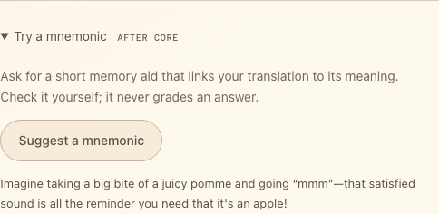

# Add a mnemonic

Optional, after lessons 1–5. Ask MAI-Thinking-1 for a memory aid that links
your translation to its meaning: button → Flask `/mnemonic` → chat completions
→ text on the card.
[API details](https://learn.microsoft.com/azure/foundry/foundry-models/how-to/use-foundry-models-mai-thinking).

## Build

### 1. Add the controls

In `starter/templates/index.html`, replace
`<!-- Extension: add mnemonic controls here. -->` with:

```html title="starter/templates/index.html"
<details class="extension">
  <summary>Try a mnemonic <span class="eyebrow">AFTER CORE</span></summary>
  <p class="muted">Ask for a short memory aid that links your translation to its meaning. Check it yourself; it never grades an answer.</p>
  <button id="generate-mnemonic" class="button secondary" type="button">Suggest a mnemonic</button>
  <p id="mnemonic-result" class="status" role="status" aria-live="polite"></p>
</details>
```

### 2. Your turn: write `/mnemonic`

In `starter/app.py`, replace `# Extension: add the /mnemonic route here.` with
a route that follows this contract. The prompt is yours to design: name the
target language, the saved translation, and its English meaning, and ask for
plain text.

| | |
| --- | --- |
| Flask receives | `POST /mnemonic` with JSON `{"word": "apple", "target": "pomme", "locale": "fr-FR"}` |
| Gateway request | `POST {base}/mai/v1/chat/completions` |
| Headers | `api-key` from `gateway()`; `json=` sets the JSON content type |
| Body | `{"model": os.getenv("MAI_THINKING_DEPLOYMENT", "mai-thinking"), "messages": [{"role": "user", "content": prompt}], "max_completion_tokens": 2048}` |
| Flask returns | `{"text": ...}` from `choices[0].message.content` |

`max_completion_tokens` caps the output *including* the model's hidden
reasoning, so keep it generous. The content is plain text, not JSON. Thinking
takes 5–20 seconds, while httpx waits only 5 seconds by default, so pass
`timeout=TIMEOUT` as in the earlier lessons.

```python title="Your turn: starter/app.py"
@app.post("/mnemonic")
def mnemonic():
    data = json_body()
    word = text_field(data, "word")
    target = text_field(data, "target")
    language = language_for(data.get("locale"))
    base, headers = gateway()
    prompt = "TODO: ask for a mnemonic that links target to word in language['label']."
    # TODO 1: httpx.post the contract's JSON body to f"{base}/mai/v1/chat/completions"
    #         with json=..., headers=headers, and timeout=TIMEOUT.
    # TODO 2: payload = upstream_json(response); read choices[0].message.content.
    # TODO 3: abort(502, ...) if it is missing or empty; else return jsonify(text=text.strip()).
    abort(501, "Extension: finish the /mnemonic route.")
```

??? success "Reference solution"

    ```python title="starter/app.py"
    @app.post("/mnemonic")
    def mnemonic():
        data = json_body()
        word = text_field(data, "word")
        target = text_field(data, "target")
        language = language_for(data.get("locale"))
        base, headers = gateway()
        prompt = (
            f"Write one short, imaginative mnemonic that helps an English speaker remember "
            f"that the {language['label']} word {target!r} means {word!r}. Link the sound "
            f"or spelling of {target!r} to that meaning. Use at most two sentences of plain "
            f"text without Markdown. Do not claim that it is a verified fact."
        )
        response = httpx.post(
            f"{base}/mai/v1/chat/completions", headers=headers,
            json={
                "model": os.getenv("MAI_THINKING_DEPLOYMENT", "mai-thinking"),
                "messages": [{"role": "user", "content": prompt}],
                "max_completion_tokens": 2048,
            }, timeout=TIMEOUT,
        )
        payload = upstream_json(response)
        choices = payload.get("choices")
        if not isinstance(choices, list) or not choices or not isinstance(choices[0], dict):
            abort(502, "The reasoning model returned no suggestion.")
        message = choices[0].get("message")
        text = message.get("content") if isinstance(message, dict) else None
        if not isinstance(text, str) or not text.strip():
            abort(502, "No text suggestion was returned. The model may have used its whole output budget.")
        return jsonify(text=text.strip())
    ```

### 3. Wire the button

In `starter/static/app.js`, replace `// Extension: add mnemonics here.` with:

```javascript title="starter/static/app.js"
$("#generate-mnemonic").addEventListener("click", () => {
  const word = selectedWord();
  runAction("MAI Thinking is considering your word...", async () => {
    const response = await callApp("/mnemonic", jsonOptions({
      word: word.english, target: word.target, locale: word.locale,
    }));
    const result = await appJSON(response);
    if (typeof result.text !== "string" || !result.text.trim()) {
      throw new Error("No text suggestion was returned.");
    }
    $("#mnemonic-result").textContent = result.text;
  });
});
onWordChange(() => {
  $("#mnemonic-result").textContent = "";
});
```

**Run:** save and reload, select a word, expand **Try a mnemonic**, and press
**Suggest a mnemonic**. The suggestion appears on the card in about 5–20
seconds. `textContent` shows it as plain text, even if the model sends markup.

{ width="484" loading="lazy" }

*Captured with a recorded example response.*

## Try one

- Ask for `one simple example sentence in {language['label']} that uses
  {target!r}, followed by its English translation` instead of a mnemonic.
- Replace `imaginative` with `practical and understated` and compare.

Request the same word each time and keep your preferred prompt. Answer
matching stays deterministic; the model never grades an answer.
