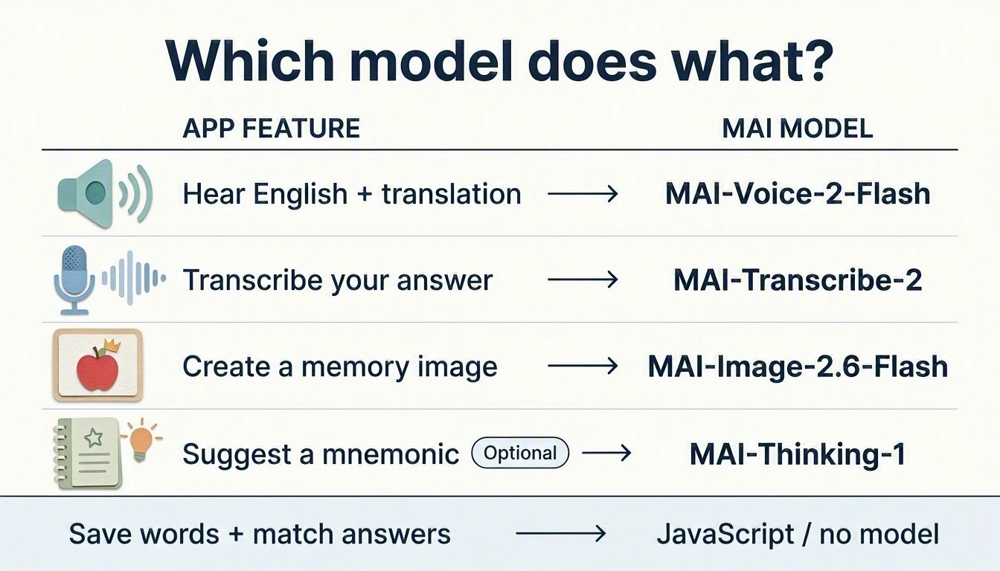

# Build a vocabulary app with MAI

Use Flask and browser JavaScript to add speech, voice answers, and memory images
to a vocabulary list.

**[Set up your Codespace](getting-ready.md)**, then follow the steps below.
Work in `starter/`. In each model lesson you paste the controls, write the
MAI call from a short contract (a reference solution is folded underneath),
check it, and try one experiment. `checkpoints/` lets you catch up;
`solution/` is the finished app.

See the app in action

<picture>
  <source media="(prefers-reduced-motion: reduce)" srcset="assets/workshop/walkthrough-poster.webp">
  
</picture>

Silent walkthrough with example model responses. Loops at a slower pace; close this panel to hide it.

| Step | What you build | You write |
| --- | --- | --- |
| [00 — Open the app](lessons/00-open-your-app.md) | A page served by Flask. | — |
| [01 — Word list](lessons/01-word-list.md) | Word pairs saved in the browser. | — |
| [02 — Speech](lessons/02-bilingual-speech.md) | English and target-language playback. | The `/speak` route |
| [03 — Transcription](lessons/03-record-and-transcribe.md) | Recording and recognized text. | The `/transcribe` route |
| [04 — Matching](lessons/04-check-your-answer.md) | Feedback on the spoken answer. | `normalizeAnswer` |
| [05 — Images](lessons/05-memory-images.md) | A generated visual cue for each word. | The `/image` route |

Next: [add MAI-Thinking mnemonics](extensions/mnemonics.md).

## Which models you use

{ width="960" height="549" loading="lazy" }

*MAI-generated diagram. [Full size](assets/diagrams/feature-model-map.webp) · [Prompts and revisions](assets/diagrams/provenance.json).*

Speech reads your saved text; it does not translate it.

[Explore the MAI family and compare costs](compare-models.md).

[Local setup](local-setup.md) · [API and troubleshooting](reference.md)
