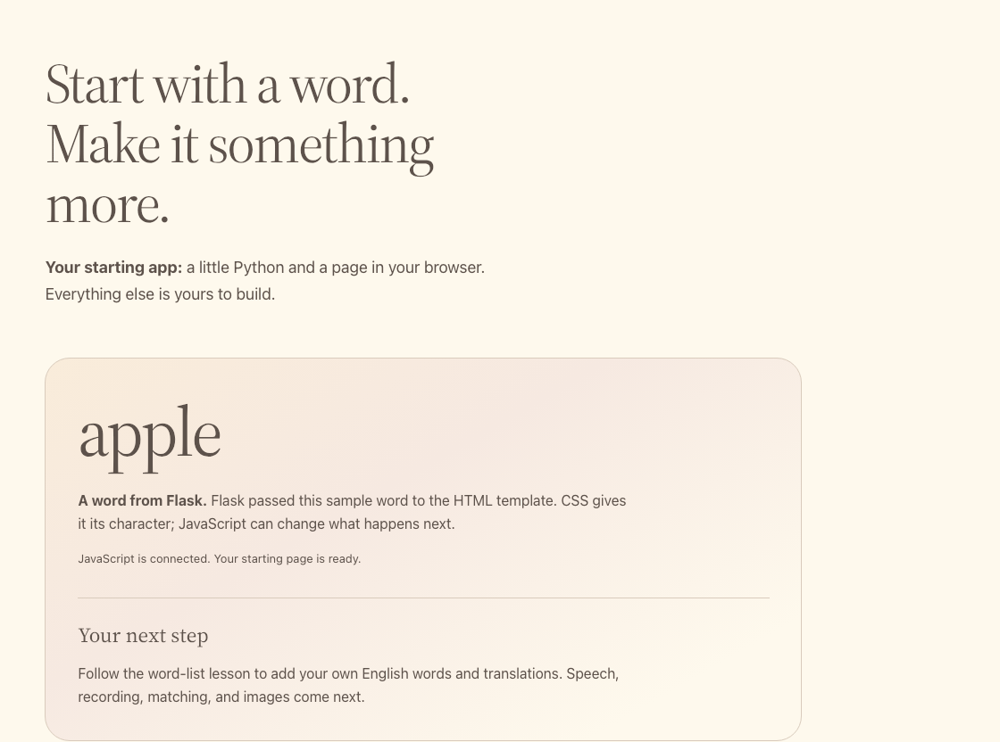

# Open your app

Run the starter and see how Flask, HTML, CSS, and JavaScript produce the page.
Complete [setup](../getting-ready.md) first.

## Run

From the repository root on `main`:

```sh
python -m flask --app starter/app.py run --reload --host 0.0.0.0 --port 5050
```

Open **Your app — 5050** from **Ports > Open in Browser**. You should see
`apple` and "JavaScript is connected."

`--reload` restarts Flask whenever you save a Python file, and templates reload
on their own, so after an edit you only **save and reload the browser**. The
terminal prints `Detected change … reloading`. Restart Flask yourself only after
changing `.env`.

To compare with the finished app, run this in a second terminal:

```sh
python -m flask --app solution/app.py run --reload --host 0.0.0.0 --port 5051
```

## Your files and the provided ones

| File | Role |
| --- | --- |
| `app.py` | **Yours.** Flask routes that call the MAI models. |
| `templates/index.html` | **Yours.** Page structure and controls. |
| `static/app.js` | **Yours.** Browser interactions and state. |
| `workshop.py` | Provided. Creates the Flask app with request checks, security headers, and readable errors; validates input and model output. |
| `static/workshop.js` | Provided. Busy state, calls to Flask, audio playback, and the recorder with WAV conversion. |
| `static/style.css` | Provided. Keep the supplied styles. |

Read the provided files whenever you like; you will not edit them. The
[reference](../reference.md#provided-helpers) lists their helpers.

Flask passes the word into the template. The browser loads CSS for styling and
JavaScript for interactions.

**Check:** reload and inspect Network: `GET /`, `/static/style.css`, and
`/static/app.js`.

{ width="960" loading="lazy" }

## How each lesson works

1. **Paste the controls.** Lesson 1 adds marker comments such as
   `# Lesson 2: add the /speak route here.` Each later edit replaces one whole
   marker line; every marker is unique.
2. **Write the model call.** Each model lesson gives a contract table and a
   skeleton with TODOs. The reference solution is folded underneath if you get
   stuck.
3. **Run the check**, then **try one** experiment.

Fell behind or broke something? `python checkpoints/restore.py 02` copies a
lesson's finished files over yours, after backing yours up to
`.checkpoint-backups/`; `python checkpoints/restore.py undo` brings yours back.
Flask reloads on its own either way.

## Try one

- Change `sample_word="apple"` to `"river"` in `starter/app.py` and save. Watch
  the terminal reload Flask, then reload the browser: the word changes, but the
  JavaScript message does not.
- Change the status string in `starter/static/app.js`. Reload: only the message
  changes.

[Next: build the word list](01-word-list.md).
