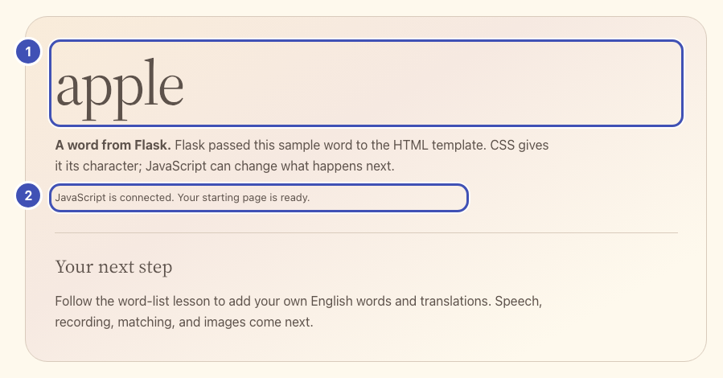

# Open your app

Run the starter and see how Flask, HTML, CSS, and JavaScript produce the page.
Complete [setup](../getting-ready.md) first.

## Run

From the repository root on `main`:

```sh
python -m flask --app starter/app.py run --reload --host 0.0.0.0 --port 5050
```

Open **Your app — 5050** from **Ports > Open in Browser**. You should see
`apple` and "JavaScript is connected."

`--reload` restarts Flask whenever you save a Python file, and templates reload
on their own, so after an edit you only **save and reload the browser**. The
terminal prints `Detected change … reloading`. Restart Flask yourself only after
changing `.env`.

To compare with the finished app, run this in a second terminal:

```sh
python -m flask --app solution/app.py run --reload --host 0.0.0.0 --port 5051
```

## Your files and the provided ones

| File | Role |
| --- | --- |
| `app.py` | **Yours.** Flask routes that call the MAI models. |
| `templates/index.html` | **Yours.** Page structure and controls. |
| `static/app.js` | **Yours.** Browser interactions and state. |
| `workshop.py` | Provided. Creates the Flask app with request checks, security headers, and readable errors; validates input and model output. |
| `static/workshop.js` | Provided. Busy state, calls to Flask, audio playback, and the recorder with WAV conversion. |
| `static/style.css` | Provided. Keep the supplied styles. |

!!! question "Why two provided files?"

    They hold what every web app needs but is not about MAI: request checks,
    security headers, readable errors, and audio conversion. Keeping them apart
    leaves your three files for the part you are here to learn.

Read the provided files whenever you like; you will not edit them. The
[reference](../reference.md#provided-helpers) lists their helpers.

### Where the page comes from

{ width="899" loading="lazy" }

- ❶ **The word** comes from Flask: `app.py` passes `sample_word` into the template.
- ❷ **The status line** comes from JavaScript: `app.js` writes it after the page loads.

The same numbers mark the lines that produce them. Nothing to paste yet:

```python title="starter/app.py (excerpt)" hl_lines="3 4"
@app.get("/")
def index():
    # ❶
    return render_template("index.html", sample_word="apple")
```

```html title="starter/templates/index.html (excerpt)" hl_lines="1 2 4 5"
<!-- ❶ -->
<h2 class="starter-word">{{ sample_word }}</h2>
<p><strong>A word from Flask.</strong> Flask passed this sample word to the HTML template. CSS gives it its character; JavaScript can change what happens next.</p>
<!-- ❷ -->
<p id="starter-status" class="status" role="status"></p>
```

```javascript title="starter/static/app.js (excerpt)" hl_lines="1 2"
// ❷
document.querySelector("#starter-status").textContent =
  "JavaScript is connected. Your starting page is ready.";
```

**Check:** reload and inspect Network: `GET /`, `/static/style.css`, and
`/static/app.js`. The browser loads CSS for styling and JavaScript for
interactions.

## How each lesson works

1. **Paste the controls.** Lesson 1 adds marker comments such as
   `# Lesson 2: add the /speak route here.` Each later edit replaces one whole
   marker line; every marker is unique.
2. **Write the model call.** Each model lesson gives a contract table and a
   skeleton with TODOs. The reference solution is folded underneath if you get
   stuck.
3. **Run the check**, then **try one** experiment.

Fell behind or broke something? `python checkpoints/restore.py 02` copies a
lesson's finished files over yours, after backing yours up to
`.checkpoint-backups/`; `python checkpoints/restore.py undo` brings yours back.
Flask reloads on its own either way.

## Try one

- Change `sample_word="apple"` to `"river"` in `starter/app.py` and save. Watch
  the terminal reload Flask, then reload the browser: the word changes, but the
  JavaScript message does not.
- Change the status string in `starter/static/app.js`. Reload: only the message
  changes.

[Next: build the word list](01-word-list.md).
