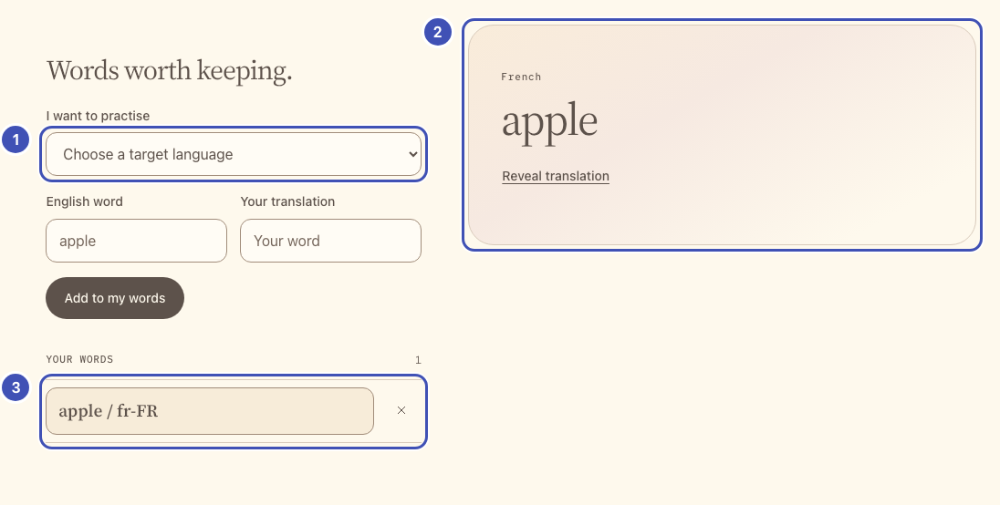
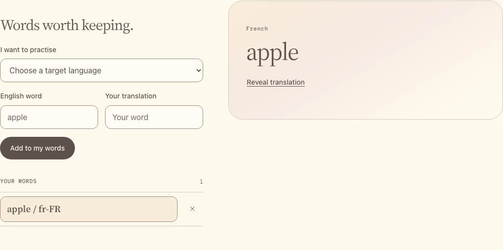

# Make it your vocabulary

Add word pairs, select one to practise, and keep the list after reload.
Flask supplies the language menu; JavaScript renders the list and saves it in
`localStorage`. No model call yet.

This is the only lesson that replaces whole files. The new files contain a
**marker comment for every later edit**, and `app.py` already imports what later
lessons need, so every later step replaces one marker line.

## Build

**What you'll build.**

{ width="960" loading="lazy" }

- ❶ **Language menu**: Flask fills it from `LANGUAGES` (step 1) through the template's `<select>` loop (step 2).
- ❷ **Practice card**: markup from step 2; `selectWord` fills it when you pick a word (step 3).
- ❸ **Your words**: `renderList` draws them from `localStorage` (step 3) into the list from step 2.

The same numbers mark the highlighted lines in the code below. Keep or delete
those `❶` comments; they only link code to the picture.

### 1. Supply the language menu

!!! question "Why does Flask own the language list?"

    Each entry pairs a voice (lesson 2) with a transcription code (lesson 3).
    Keeping the list on the server means the browser can only pick combinations the
    models support.

**Replace all of `starter/app.py`.** Each `LANGUAGES` entry maps a menu label to
a [documented MAI voice](../reference.md#languages-and-voices) (lesson 2) and a
transcription language code (lesson 3). `language_for` rejects anything else.

```python title="starter/app.py" hl_lines="52 53"
"""Your vocabulary app.

The imports cover every lesson, so later steps only replace the marker
comments at the bottom of this file.
"""

import base64
import binascii
import json
import os
from xml.sax.saxutils import escape

import httpx
from flask import Response, abort, jsonify, render_template, request

from workshop import (
    TIMEOUT, check_png, check_wav, create_app, gateway, json_body,
    optional_text, text_field, upstream_json,
)

app = create_app(__name__)

LANGUAGES = {
    "en-US": {"label": "English (US)", "stt": "en", "voice": "en-US-Harper:MAI-Voice-2-Flash"},
    "zh-CN": {"label": "Chinese (Simplified Mandarin)", "stt": "zh", "voice": "zh-CN-Mei:MAI-Voice-2-Flash"},
    "nl-NL": {"label": "Dutch", "stt": "nl", "voice": "nl-NL-Sander:MAI-Voice-2-Flash"},
    "fr-FR": {"label": "French", "stt": "fr", "voice": "fr-FR-Soleil:MAI-Voice-2-Flash"},
    "de-DE": {"label": "German", "stt": "de", "voice": "de-DE-Mia:MAI-Voice-2-Flash"},
    "hi-IN": {"label": "Hindi", "stt": "hi", "voice": "hi-IN-Kavya:MAI-Voice-2-Flash"},
    "hu-HU": {"label": "Hungarian", "stt": "hu", "voice": "hu-HU-Lilla:MAI-Voice-2-Flash"},
    "it-IT": {"label": "Italian", "stt": "it", "voice": "it-IT-Rosa:MAI-Voice-2-Flash"},
    "ko-KR": {"label": "Korean", "stt": "ko", "voice": "ko-KR-Haena:MAI-Voice-2-Flash"},
    "pt-BR": {"label": "Portuguese (Brazil)", "stt": "pt", "voice": "pt-BR-Luana:MAI-Voice-2-Flash"},
    "pt-PT": {"label": "Portuguese (Portugal)", "stt": "pt", "voice": "pt-PT-Rui:MAI-Voice-2-Flash"},
    "ro-RO": {"label": "Romanian", "stt": "ro", "voice": "ro-RO-Elena:MAI-Voice-2-Flash"},
    "ru-RU": {"label": "Russian", "stt": "ru", "voice": "ru-RU-Masha:MAI-Voice-2-Flash"},
    "es-ES": {"label": "Spanish (Spain)", "stt": "es", "voice": "es-ES-Marta:MAI-Voice-2-Flash"},
    "es-MX": {"label": "Spanish (Mexico)", "stt": "es", "voice": "es-MX-Valeria:MAI-Voice-2-Flash"},
    "th-TH": {"label": "Thai", "stt": "th", "voice": "th-TH-Krit:MAI-Voice-2-Flash"},
    "tr-TR": {"label": "Turkish", "stt": "tr", "voice": "tr-TR-Elif:MAI-Voice-2-Flash"},
}


def language_for(locale):
    if not isinstance(locale, str) or locale not in LANGUAGES:
        abort(400, "Choose a language from the supported list.")
    return LANGUAGES[locale]


@app.get("/")
def index():
    # ❶
    return render_template("index.html", languages=LANGUAGES)


# Lesson 2: add the /speak route here.


# Lesson 3: add the /transcribe route here.


# Lesson 5: add the /image route here.


# Extension: add the /mnemonic route here.
```

### 2. Give the list and practice card a home

!!! question "Why replace the whole page now?"

    It adds a marker comment for every later lesson, so each later step replaces
    one line and you never hunt for the right spot.

**Replace all of `starter/templates/index.html`.** It loads the provided
`workshop.js` before your `app.js`. If the gateway settings are missing, the
page tells you; the word list works without them.

```html title="starter/templates/index.html" hl_lines="31 32 45 46 50 51"
<!doctype html>
<html lang="en">
<head>
  <meta charset="utf-8">
  <meta name="viewport" content="width=device-width, initial-scale=1">
  <title>My words | MAI Workshop</title>
  <link rel="stylesheet" href="{{ url_for('static', filename='style.css') }}">
  <script src="{{ url_for('static', filename='workshop.js') }}" defer></script>
  <script src="{{ url_for('static', filename='app.js') }}" defer></script>
</head>
<body>
  <a class="skip-link" href="#main">Skip to your words</a>
  <header class="site-header">
    <a class="brand" href="/">MAI <span>WORKSHOP</span></a>
    <span class="eyebrow">YOUR APP</span>
  </header>
  <main id="main" class="app-shell">
    <section class="intro">
      <h1>A little vocabulary.<br>A world to explore.</h1>
      <p class="intro-copy">Choose a language. Keep a word. Make it yours.</p>
      
      <p class="connection-note"><strong>No gateway settings yet.</strong> Your word list works now. Add APIM_BASE_URL and APIM_API_KEY, then restart Flask, before lesson 2.</p>
      
    </section>
    <p id="app-error" class="notice error-notice" role="alert" hidden></p>
    <div class="workspace">
      <section class="panel vocabulary-panel" aria-labelledby="list-title">
        <h2 id="list-title">Words worth keeping.</h2>
        <form id="word-form">
          <label for="target-locale">I want to practise</label>
          <!-- ❶ -->
          <select id="target-locale" required>
            <option value="">Choose a target language</option>
            
            <option value="{{ locale }}">{{ language.label }}</option>
            
          </select>
          <div class="input-pair">
            <div><label for="english-word">English word</label><input id="english-word" maxlength="120" placeholder="apple" autocomplete="off" required></div>
            <div><label for="target-word">Your translation</label><input id="target-word" maxlength="120" placeholder="Your word" autocomplete="off" required></div>
          </div>
          <button class="button primary" type="submit">Add to my words</button>
        </form>
        <div class="list-heading"><span class="eyebrow">YOUR WORDS</span><span id="word-count" class="count">0</span></div>
        <!-- ❸ -->
        <ul id="word-list" class="word-list" aria-label="Saved vocabulary"></ul>
        <p id="list-empty" class="muted">Your list stays in this browser, at this app address.</p>
        <button id="reset-storage" class="text-button" type="button" hidden>Clear unreadable saved data</button>
      </section>
      <!-- ❷ -->
      <section class="panel practice-panel" aria-label="Practise your selected word">
        <div id="practice-empty" class="empty-state">
          <div class="word-orbit" aria-hidden="true"><span>a</span><span>A</span><span>?</span></div>
          <h2>Start with a word.</h2>
          <p>Add a pair, then choose it in your list.</p>
        </div>
        <div id="practice-content" hidden>
          <div class="word-heading">
            <p id="practice-language" class="eyebrow"></p>
            <h2 id="practice-word" lang="en"></h2>
            <button id="reveal-answer" class="text-button" type="button">Reveal translation</button>
            <p id="saved-translation" class="translation" hidden></p>
          </div>
          <!-- Lesson 2: add speech controls here. -->
          <!-- Lesson 3: add answer controls here. -->
          <!-- Lesson 5: add memory controls here. -->
          <!-- Extension: add mnemonic controls here. -->
        </div>
        <p id="model-status" class="status model-status" role="status" aria-live="polite"></p>
      </section>
    </div>
  </main>
  <footer class="site-footer"><span>MAI Workshop</span><p>Use sample data only.</p></footer>
</body>
</html>
```

### 3. Save, select, and render words

!!! question "Why localStorage and hooks?"

    Your words survive a reload without a database. `onWordChange` lets later
    lessons clear old results when you switch words, without touching `selectWord`.

**Replace all of `starter/static/app.js`.** `saveWords` persists the list,
`renderList` draws it with `textContent` (entered words stay plain text), and
`selectWord` shows a pair. Later lessons react to a new selection by
registering `onWordChange(...)` hooks, so they never edit `selectWord`.
`$`, `showError`, and `isBusy` come from `workshop.js`.

```javascript title="starter/static/app.js" hl_lines="54 55 84 85"
"use strict";
// Your browser code. workshop.js loads first and provides $, showError,
// runAction, callApp, and the other helpers listed in the reference.

const STORAGE_KEY = "mai-learner-words-v1";
const wordChangeHooks = [];
let words = [];
let selectedId = null;
let storageReadable = true;

function selectedWord() {
  return words.find((word) => word.id === selectedId);
}

function onWordChange(hook) {
  wordChangeHooks.push(hook);
}

function loadWords() {
  try {
    const saved = JSON.parse(localStorage.getItem(STORAGE_KEY) || "[]");
    const locales = [...$("#target-locale").options].map((option) => option.value).filter(Boolean);
    if (!Array.isArray(saved) || saved.some((word) =>
      !word || typeof word.id !== "string" ||
      typeof word.english !== "string" || !word.english.trim() || word.english.length > 120 ||
      typeof word.target !== "string" || !word.target.trim() || word.target.length > 120 ||
      !locales.includes(word.locale)
    ) || new Set(saved.map((word) => word.id)).size !== saved.length) {
      throw new Error("Invalid saved vocabulary");
    }
    words = saved;
  } catch {
    storageReadable = false;
    $("#reset-storage").hidden = false;
    showError("Saved vocabulary is unreadable or storage is blocked. Nothing was overwritten.");
  }
}

function saveWords(nextWords) {
  if (!storageReadable) {
    showError("Clear the unreadable data explicitly before saving a new list.");
    return false;
  }
  try {
    localStorage.setItem(STORAGE_KEY, JSON.stringify(nextWords));
    words = nextWords;
    return true;
  } catch {
    showError("This browser could not save the change. Check its storage/privacy settings.");
    return false;
  }
}

// ❸
function renderList() {
  $("#word-list").replaceChildren();
  for (const word of words) {
    const row = document.createElement("li");
    const pick = document.createElement("button");
    pick.type = "button";
    pick.className = "word-choice";
    pick.textContent = `${word.english} / ${word.locale}`;
    pick.setAttribute("aria-pressed", String(word.id === selectedId));
    pick.addEventListener("click", () => selectWord(word.id));
    const remove = document.createElement("button");
    remove.type = "button";
    remove.className = "remove-word";
    remove.innerHTML = '<svg width="16" height="16" viewBox="0 0 24 24" ' +
      'fill="none" stroke="currentColor" stroke-width="1.5" aria-hidden="true">' +
      '<path d="M6 6l12 12M18 6L6 18"/></svg>';
    remove.setAttribute("aria-label", `Remove ${word.english}`);
    remove.addEventListener("click", () => {
      if (!saveWords(words.filter((item) => item.id !== word.id))) return;
      if (word.id === selectedId) selectWord(words[0]?.id ?? null);
      else renderList();
    });
    row.append(pick, remove);
    $("#word-list").append(row);
  }
  $("#word-count").textContent = String(words.length);
  $("#list-empty").hidden = words.length > 0;
}

// ❷
function selectWord(id) {
  if (isBusy()) {
    showError("Wait for the current action to finish.");
    return;
  }
  selectedId = id;
  const word = selectedWord();
  $("#practice-empty").hidden = Boolean(word);
  $("#practice-content").hidden = !word;
  if (word) {
    $("#practice-word").textContent = word.english;
    $("#saved-translation").textContent = word.target;
    $("#saved-translation").lang = word.locale;
    $("#saved-translation").hidden = true;
    $("#reveal-answer").textContent = "Reveal translation";
    $("#practice-language").textContent = [...$("#target-locale").options]
      .find((option) => option.value === word.locale).textContent;
  }
  wordChangeHooks.forEach((hook) => hook(word));
  renderList();
}

$("#word-form").addEventListener("submit", (event) => {
  event.preventDefault();
  const english = $("#english-word").value.trim();
  const target = $("#target-word").value.trim();
  const locale = $("#target-locale").value;
  if (!english || !target || !locale) {
    showError("Choose a language and enter both words.");
    return;
  }
  const word = {id: crypto.randomUUID(), english, target, locale};
  if (!saveWords([...words, word])) return;
  showError("");
  $("#english-word").value = "";
  $("#target-word").value = "";
  selectWord(word.id);
  $("#english-word").focus();
});

$("#reveal-answer").addEventListener("click", () => {
  const hidden = !$("#saved-translation").hidden;
  $("#saved-translation").hidden = hidden;
  $("#reveal-answer").textContent = hidden ? "Reveal translation" : "Hide translation";
});

$("#reset-storage").addEventListener("click", () => {
  if (!confirm("Clear this app's unreadable saved vocabulary?")) return;
  try {
    localStorage.removeItem(STORAGE_KEY);
    words = [];
    storageReadable = true;
    $("#reset-storage").hidden = true;
    showError("");
    selectWord(null);
  } catch {
    showError("Storage is still blocked. Check the browser's privacy settings.");
  }
});

// Lesson 2: add speech here.

// Lesson 3: add recording here.

// Lesson 5: add memory images here.

// Extension: add mnemonics here.

// Start the page.
loadWords();
selectWord(words[0]?.id ?? null);
```

Keep `// Start the page.` and its two calls **last**: every later lesson adds
code above it, so the page starts only after all handlers exist.

**Run:** save all three files and reload the browser. Add two pairs, select
each, reveal the translation, then reload again. Both pairs remain. Remove one.
To correct a pair, remove it and add it again.

{ width="960" loading="lazy" }

**Catch up:** `python checkpoints/restore.py 01` copies this lesson's finished
files over yours, after backing yours up.

## Try one

- Add a pair in another language. Switch between entries: each keeps its own
  locale; changing the menu does not translate existing words.
- Add `summer` / `été` in French, or a non-Latin word you know. Reload and check
  that the spelling survives storage.

[Next: hear both languages](02-bilingual-speech.md).
