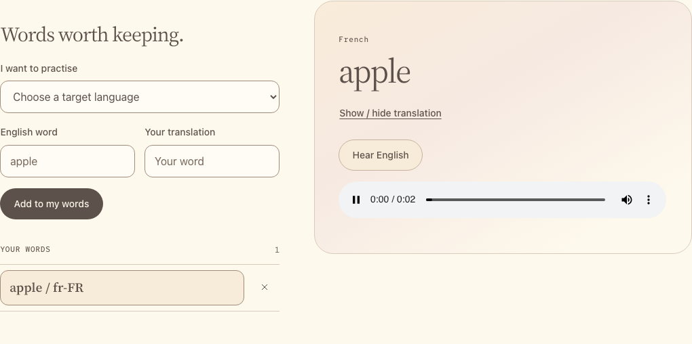
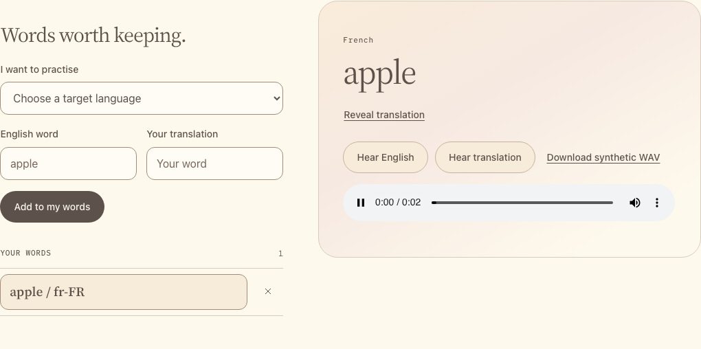

# Hear both languages

Add English playback, then reuse the route for the translation.

**Flow:** button → `fetch("/speak")` → Flask → gateway `/speech/tts` →
MAI Voice → WAV → browser playback.

[MAI Voice](https://learn.microsoft.com/azure/ai-services/speech-service/mai-voices)
accepts SSML: text plus a voice selection. We request 16 kHz mono PCM WAV,
which the next lesson can also upload. [Gateway contract](../reference.md#requests).

## Build

### 1. Configure requests and errors

In **`starter/app.py`, replace only**
`from flask import Flask, render_template` with this block. Keep the rest.

```python title="starter/app.py"
import io
import os
import wave
from pathlib import Path
from urllib.parse import urlsplit
from xml.sax.saxutils import escape

import httpx
from dotenv import load_dotenv
from flask import Flask, Response, abort, jsonify, render_template, request
from werkzeug.exceptions import HTTPException

load_dotenv(Path(__file__).resolve().parents[1] / ".env", override=False)
```

**Insert before `@app.get("/")` in `starter/app.py`.** These helpers load
connection settings, validate requests/WAV responses, and turn failures into
UI messages. Later routes reuse them.

```python title="starter/app.py"
app.config["MAX_CONTENT_LENGTH"] = 2 * 1024 * 1024
TIMEOUT = httpx.Timeout(120, connect=10)
codespace_hosts = set()
if os.getenv("CODESPACES") == "true":
    name = os.getenv("CODESPACE_NAME", "")
    domain = os.getenv("GITHUB_CODESPACES_PORT_FORWARDING_DOMAIN", "")
    if name and domain:
        codespace_hosts = {f"{name}-{port}.{domain}" for port in (5050, 5051)}
app.config["TRUSTED_HOSTS"] = ["localhost", "127.0.0.1", *codespace_hosts]


@app.before_request
def same_origin():
    if request.method == "POST":
        scheme = "https" if request.host in codespace_hosts else "http"
        if request.headers.get("Origin") != f"{scheme}://{request.host}":
            abort(403, "Open the app in its own browser tab and send from there.")


@app.after_request
def browser_headers(response):
    response.headers["Cache-Control"] = "no-store"
    response.headers["X-Content-Type-Options"] = "nosniff"
    response.headers["Permissions-Policy"] = "microphone=(self), camera=()"
    response.headers["Content-Security-Policy"] = (
        "default-src 'self'; script-src 'self'; style-src 'self'; "
        "img-src 'self' blob:; media-src 'self' blob:; font-src 'self'; "
        "connect-src 'self'; object-src 'none'; base-uri 'self'; "
        "frame-ancestors 'none'; form-action 'self'"
    )
    return response


def gateway_settings():
    base = os.getenv("APIM_BASE_URL", "").rstrip("/")
    key = os.getenv("APIM_API_KEY", "")
    try:
        parsed = urlsplit(base)
        port = parsed.port
    except ValueError:
        abort(503, "APIM_BASE_URL must be a valid HTTPS gateway origin.")
    if (
        parsed.scheme != "https" or not parsed.hostname or parsed.path
        or parsed.query or parsed.fragment or parsed.username or parsed.password
        or port == 0 or "\\" in base or any(char.isspace() for char in base)
        or not key or key in {"replace-me", "your-participant-key"}
        or any(char.isspace() for char in key)
    ):
        abort(503, "Configure APIM_BASE_URL and APIM_API_KEY, then restart Flask.")
    return base, {"api-key": key}


def json_body():
    data = request.get_json()
    if not isinstance(data, dict):
        abort(400, "Send a JSON object.")
    return data


def text_field(data, name, limit=120):
    value = data.get(name)
    if not isinstance(value, str) or not value.strip() or len(value) > limit:
        abort(400, f"{name} must contain 1 to {limit} characters.")
    if any(
        (ord(char) < 32 and char not in "\t\n\r")
        or 0xD800 <= ord(char) <= 0xDFFF or ord(char) in {0xFFFE, 0xFFFF}
        for char in value
    ):
        abort(400, f"{name} contains unsupported control characters.")
    return value.strip()


def language_for(locale):
    if not isinstance(locale, str) or locale not in LANGUAGES:
        abort(400, "Choose a language from the supported list.")
    return LANGUAGES[locale]


def check_wav(audio, max_seconds=12, error_status=400):
    try:
        with wave.open(io.BytesIO(audio), "rb") as wav:
            frames = wav.getnframes()
            if (
                wav.getnchannels() != 1 or wav.getsampwidth() != 2
                or wav.getframerate() != 16000 or wav.getcomptype() != "NONE"
                or not 0 < frames <= 16000 * max_seconds
                or len(wav.readframes(frames)) != frames * 2
            ):
                raise ValueError("Invalid PCM parameters")
    except (wave.Error, EOFError, ValueError):
        abort(error_status, f"Use a complete mono, 16-bit, 16 kHz WAV of up to {max_seconds} seconds.")


@app.errorhandler(HTTPException)
def request_error(error):
    app.logger.warning("App request failed: HTTP %s", error.code)
    return jsonify(error=error.description), error.code


@app.errorhandler(httpx.HTTPStatusError)
def gateway_error(error):
    status = error.response.status_code
    app.logger.warning("Gateway request failed: HTTP %s", status)
    messages = {
        400: "The model rejected the request. Check its settings and sample input.",
        401: "Your key may be expired, rotated, or invalid. Check the workshop portal.",
        403: "Access or content was blocked. Check portal access and approved sample data.",
        404: "The gateway route or deployment was not found. Check the instructor's settings.",
        429: "The model or gateway is rate limited. Wait before trying again.",
    }
    response = jsonify(error=messages.get(status, "The model service is unavailable. Try again later."))
    response.status_code = status if status in messages else 502
    retry = error.response.headers.get("Retry-After", "")
    if status == 429 and retry.isdigit():
        response.headers["Retry-After"] = str(min(int(retry), 300))
    return response


@app.errorhandler(httpx.RequestError)
def connection_error(error):
    app.logger.warning("Gateway connection failed: %s", type(error).__name__)
    return jsonify(error="The gateway could not be reached in time. Check your connection and try again."), 504
```

### 2. Make English playback work

**Append to `starter/app.py`.** `escape(text)` makes the word valid SSML text;
the response contains audio bytes.

```python title="starter/app.py"
@app.post("/speak")
def speak():
    data = json_body()
    text = text_field(data, "text")
    locale = "en-US"
    language = language_for(locale)
    base, headers = gateway_settings()
    ssml = (
        '<speak version="1.0" xmlns="http://www.w3.org/2001/10/synthesis" '
        f'xml:lang="{locale}"><voice name="{language["voice"]}">'
        f"{escape(text)}</voice></speak>"
    )
    response = httpx.post(
        f"{base}/speech/tts",
        headers={**headers, "Content-Type": "application/ssml+xml",
                 "X-Microsoft-OutputFormat": "riff-16khz-16bit-mono-pcm",
                 "User-Agent": "mai-vocabulary-workshop"},
        content=ssml.encode("utf-8"), timeout=TIMEOUT,
    )
    response.raise_for_status()
    check_wav(response.content, max_seconds=60, error_status=502)
    return Response(response.content, mimetype="audio/wav")
```

In **`starter/templates/index.html`, replace**
`<!-- Add speech controls here. -->`** with:

```html title="starter/templates/index.html"
<div class="listen-actions">
  <button id="speak-english" class="button secondary" type="button">Hear English</button>
  <!-- Add target playback here. -->
</div>
<audio id="speech-audio" controls hidden aria-label="Generated speech"></audio>
```

In **`starter/static/app.js`, insert before `// Start the page.`**
`runAction` manages progress and locks competing controls. Its attempt number
prevents cancelled work from changing a newer action's UI. `speechBlob` caches
audio by text/locale; `playSpeech` plays it.

```javascript title="starter/static/app.js"
let busy = false;
let actionVersion = 0;
let speechUrl = null;
const speechCache = new Map();

function setBusy(value) {
  busy = value;
  document.querySelectorAll("button, input, select").forEach((control) => {
    control.disabled = value;
  });
  if ($("#stop-recording")) $("#stop-recording").disabled = false;
  if ($("#audio-consent")) $("#audio-consent").disabled = false;
}

async function runAction(message, action) {
  if (busy) {
    showError("Wait for the current action to finish.");
    return;
  }
  showError("");
  const attempt = ++actionVersion;
  setBusy(true);
  $("#model-status").textContent = message;
  try {
    await action(attempt);
  } catch (error) {
    if (attempt === actionVersion) {
      showError(error.message || "The action failed. Check the server and try again.");
    }
  } finally {
    if (attempt === actionVersion) {
      setBusy(false);
      $("#model-status").textContent = "";
    }
  }
}

function jsonOptions(body) {
  return {method: "POST", headers: {"Content-Type": "application/json"}, body: JSON.stringify(body)};
}

async function appJSON(response) {
  if (!response.headers.get("Content-Type")?.includes("application/json")) {
    throw new Error("Expected JSON from Flask. Reopen the private app port if sign-in expired.");
  }
  let body;
  try { body = await response.json(); }
  catch { throw new Error("Flask returned unreadable JSON."); }
  if (!body || typeof body !== "object" || Array.isArray(body)) {
    throw new Error("Flask returned an unexpected response shape.");
  }
  return body;
}

async function callApp(path, options) {
  let response;
  try {
    response = await fetch(path, {...options, mode: "same-origin", credentials: "same-origin"});
  } catch {
    throw new Error("Cannot reach Flask. Check its terminal or reopen the private Codespaces port.");
  }
  if (!response.ok) {
    let message = `Request failed (${response.status}). Reopen the app if Codespaces sign-in expired.`;
    if (response.headers.get("Content-Type")?.includes("application/json")) {
      const body = await appJSON(response);
      if (typeof body.error === "string") message = body.error;
    }
    const retry = response.headers.get("Retry-After");
    if (retry && /^\d+$/.test(retry)) message += ` Retry after ${retry} seconds.`;
    throw new Error(message);
  }
  return response;
}

function stopPlayback() {
  $("#speech-audio").pause();
  $("#speech-audio").removeAttribute("src");
  $("#speech-audio").hidden = true;
  if (speechUrl) URL.revokeObjectURL(speechUrl);
  speechUrl = null;
}

async function speechBlob(text, locale) {
  const key = JSON.stringify([text, locale]);
  if (!speechCache.has(key)) {
    const response = await callApp("/speak", jsonOptions({text}));
    if (!response.headers.get("Content-Type")?.includes("audio/wav")) {
      throw new Error("Expected WAV audio. Reopen the app if Codespaces sign-in expired.");
    }
    speechCache.set(key, await response.blob());
  }
  return speechCache.get(key);
}

async function playSpeech(text, locale) {
  const blob = await speechBlob(text, locale);
  stopPlayback();
  speechUrl = URL.createObjectURL(blob);
  $("#speech-audio").src = speechUrl;
  $("#speech-audio").hidden = false;
  try { await $("#speech-audio").play(); }
  catch { throw new Error("Automatic playback was blocked. Use the visible audio player's Play button."); }
}

$("#speak-english").addEventListener("click", () => {
  runAction("Asking MAI Voice for English audio...", () => playSpeech(selectedWord().english, "en-US"));
});
$("#speech-audio").addEventListener("error", () => showError("The browser could not play the WAV."));
window.addEventListener("pagehide", stopPlayback);
```

In the same file, **insert immediately after `function selectWord(id) {`**:

```javascript title="starter/static/app.js"
  if (busy) { showError("Wait for the current action to finish."); return; }
  stopPlayback();
```

**Run:** restart Flask, reload, and press **Hear English**.
Network should show `POST /speak` with `text` and an `audio/wav` response.

{ width="960" loading="lazy" }

*Captured with an example audio response.*

### 3. Extend that route to the target language

In **`starter/app.py`**, inside `speak`, **replace only**
`locale = "en-US"` with:

```python title="starter/app.py"
    locale = data.get("locale")
```

In **`starter/static/app.js`**, inside `speechBlob`, **replace only**
`jsonOptions({text})` with `jsonOptions({text, locale})`. The browser now sends
`en-US` or the saved target locale.

In **`starter/templates/index.html`**, **replace**
`<!-- Add target playback here. -->` with:

```html title="starter/templates/index.html"
<button id="speak-target" class="button secondary" type="button">Hear translation</button>
<button id="download-sample" class="text-button" type="button">Download synthetic WAV</button>
```

In **`starter/static/app.js`**, **insert before `// Start the page.`**:

```javascript title="starter/static/app.js"
$("#speak-target").addEventListener("click", () => {
  const word = selectedWord();
  runAction("Asking MAI Voice for your translation...", () => playSpeech(word.target, word.locale));
});
$("#download-sample").addEventListener("click", () => {
  runAction("Preparing synthetic target-language audio...", async () => {
    const word = selectedWord();
    const blob = await speechBlob(word.target, word.locale);
    const url = URL.createObjectURL(blob);
    const link = document.createElement("a");
    link.href = url;
    link.download = `sample-${word.locale}.wav`;
    link.click();
    setTimeout(() => URL.revokeObjectURL(url), 1000);
  });
});
```

The locale maps to a voice, whose name selects MAI-Voice-2-Flash.
The API reads supplied text; it does not translate it.

**Run:** restart Flask and reload. Play both languages and compare their
`text`/`locale` fields in Network. Download a short synthetic WAV and keep it
for lesson 3.

{ width="960" loading="lazy" }

*Captured with example audio responses.*

## Try one

- Add a short phrase and compare its playback with an isolated word.
- Add `apple` / `manzana` for Spanish (Spain) and Spanish (Mexico). Compare
  Marta and Valeria, selected by `es-ES` and `es-MX`.

Reload to clear cached audio after changing Python voice settings.

[Next: record and transcribe](03-record-and-transcribe.md).
