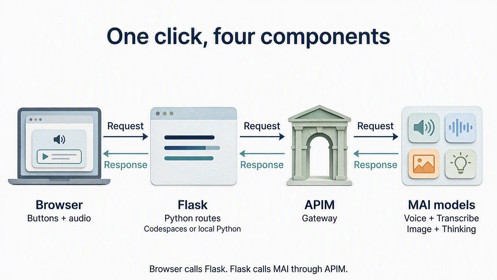

# Hear both languages

Play the English word and its translation with MAI-Voice-2-Flash. You write
the Flask route that calls the gateway; the browser wiring is a short paste.

{ width="960" height="542" loading="lazy" }

*MAI-generated diagram. [Full size](../assets/diagrams/request-loop.webp).*

## How it works

The browser posts `{text, locale}` to your Flask route `/speak`. Flask adds
your key on the server and posts
[SSML](https://learn.microsoft.com/azure/ai-services/speech-service/mai-voices)
to the gateway's `/speech/tts`; the answer is WAV audio. We ask for 16 kHz mono
PCM, which lesson 3 can upload again. The voice name in `LANGUAGES` picks the
speaker *and* the model (`…:MAI-Voice-2-Flash`). MAI Voice reads the text you
saved; it does not translate.

The provided `workshop.py` does the plumbing: `gateway()` returns the gateway
origin and the `api-key` header, `json_body()` and `text_field()` validate the
request, `check_wav()` rejects anything that is not 16 kHz mono PCM, and gateway
failures such as 401 or 429 become short messages in the app.

## Build

### 1. Add the speech controls

In `starter/templates/index.html`, replace
`<!-- Lesson 2: add speech controls here. -->` with:

```html title="starter/templates/index.html"
<div class="listen-actions">
  <button id="speak-english" class="button secondary" type="button">Hear English</button>
  <button id="speak-target" class="button secondary" type="button">Hear translation</button>
  <button id="download-sample" class="text-button" type="button">Download synthetic WAV</button>
</div>
<audio id="speech-audio" controls hidden aria-label="Generated speech"></audio>
```

### 2. Your turn: write `/speak`

In `starter/app.py`, replace `# Lesson 2: add the /speak route here.` with a
route that follows this contract. Paste the skeleton and finish its TODOs, or
write it from scratch.

| | |
| --- | --- |
| Flask receives | `POST /speak` with JSON `{"text": "pomme", "locale": "fr-FR"}` |
| Gateway request | `POST {base}/speech/tts` |
| Headers | `api-key` from `gateway()`, `Content-Type: application/ssml+xml`, `X-Microsoft-OutputFormat: riff-16khz-16bit-mono-pcm`, `User-Agent: mai-vocabulary-workshop` |
| Body | SSML that names `LANGUAGES[locale]["voice"]` and contains the escaped text |
| Flask returns | The WAV bytes as `audio/wav`, after `check_wav(audio, max_seconds=60, error_status=502)` |

```python title="Your turn: starter/app.py"
@app.post("/speak")
def speak():
    data = json_body()
    text = text_field(data, "text")
    locale = data.get("locale")
    language = language_for(locale)
    base, headers = gateway()
    # TODO 1: Build the SSML from the hint with escape(text) and language["voice"].
    # TODO 2: httpx.post it to f"{base}/speech/tts" with the contract's headers,
    #         content=ssml.encode("utf-8"), and timeout=TIMEOUT. Then raise_for_status().
    # TODO 3: check_wav(response.content, max_seconds=60, error_status=502) and
    #         return Response(response.content, mimetype="audio/wav").
    abort(501, "Lesson 2: finish the /speak route.")
```

??? tip "Hint: SSML for one word"

    ```xml
    <speak version="1.0" xmlns="http://www.w3.org/2001/10/synthesis" xml:lang="fr-FR">
      <voice name="fr-FR-Soleil:MAI-Voice-2-Flash">pomme</voice>
    </speak>
    ```

    `escape` (already imported) turns `&` and `<` in the word into valid XML.
    Add the extra headers to the `api-key` header with `{**headers, ...}`.
    `raise_for_status()` lets `workshop.py` turn a 401 or 429 into a readable message.

??? success "Reference solution"

    ```python title="starter/app.py"
    @app.post("/speak")
    def speak():
        data = json_body()
        text = text_field(data, "text")
        locale = data.get("locale")
        language = language_for(locale)
        base, headers = gateway()
        ssml = (
            '<speak version="1.0" xmlns="http://www.w3.org/2001/10/synthesis" '
            f'xml:lang="{locale}"><voice name="{language["voice"]}">'
            f"{escape(text)}</voice></speak>"
        )
        response = httpx.post(
            f"{base}/speech/tts",
            headers={**headers, "Content-Type": "application/ssml+xml",
                     "X-Microsoft-OutputFormat": "riff-16khz-16bit-mono-pcm",
                     "User-Agent": "mai-vocabulary-workshop"},
            content=ssml.encode("utf-8"), timeout=TIMEOUT,
        )
        response.raise_for_status()
        check_wav(response.content, max_seconds=60, error_status=502)
        return Response(response.content, mimetype="audio/wav")
    ```

### 3. Wire the buttons

In `starter/static/app.js`, replace `// Lesson 2: add speech here.` with the
code below. `speechBlob` caches audio per text and locale, so replaying or
downloading does not call the model again. `playAudio`, `stopAudio`, and
`downloadBlob` come from `workshop.js`.

```javascript title="starter/static/app.js"
const speechCache = new Map();

async function speechBlob(text, locale) {
  const key = JSON.stringify([text, locale]);
  if (!speechCache.has(key)) {
    const response = await callApp("/speak", jsonOptions({text, locale}));
    if (!response.headers.get("Content-Type")?.includes("audio/wav")) {
      throw new Error("Expected WAV audio. Reopen the app if Codespaces sign-in expired.");
    }
    speechCache.set(key, await response.blob());
  }
  return speechCache.get(key);
}

$("#speak-english").addEventListener("click", () => {
  const word = selectedWord();
  runAction("Asking MAI Voice for English audio...", async () => {
    await playAudio($("#speech-audio"), await speechBlob(word.english, "en-US"));
  });
});
$("#speak-target").addEventListener("click", () => {
  const word = selectedWord();
  runAction("Asking MAI Voice for your translation...", async () => {
    await playAudio($("#speech-audio"), await speechBlob(word.target, word.locale));
  });
});
$("#download-sample").addEventListener("click", () => {
  const word = selectedWord();
  runAction("Preparing synthetic target-language audio...", async () => {
    downloadBlob(await speechBlob(word.target, word.locale), `sample-${word.locale}.wav`);
  });
});
onWordChange(() => stopAudio($("#speech-audio")));
window.addEventListener("pagehide", () => stopAudio($("#speech-audio")));
```

**Run:** save; Flask reloads on its own (watch its terminal). Reload the
browser, then press **Hear English** and **Hear translation**. Network shows
`POST /speak` with `text` and `locale`, answered by `audio/wav` in about a
second. Press **Download synthetic WAV** and keep the file for lesson 3.

Still seeing *Lesson 2: finish the /speak route.*? The skeleton's last line is
still in place.

{ width="960" loading="lazy" }

*Captured with example audio responses.*

**Catch up:** `python checkpoints/restore.py 02` copies this lesson's finished
files over yours, after backing yours up.

## Try one

The app caches audio per page, so reload the page after each change.

- **Slow it down for learners.** In your SSML, wrap the escaped text in
  `<prosody rate="-30%">…</prosody>`. Save a short phrase such as
  `Je voudrais une pomme, s'il vous plaît.` and compare: the audio is about 40%
  longer.
- **Compare two voices.** Add `apple` / `manzana` for Spanish (Spain) and
  Spanish (Mexico) to hear Marta and Valeria.
- **Compare two models.** In `LANGUAGES`, change
  `fr-FR-Soleil:MAI-Voice-2-Flash` to `fr-FR-Soleil:MAI-Voice-2` and compare the
  sound and the `/speak` time in Network. Every menu voice except
  `ko-KR-Haena` also exists for MAI-Voice-2.

[Next: record and transcribe](03-record-and-transcribe.md).
