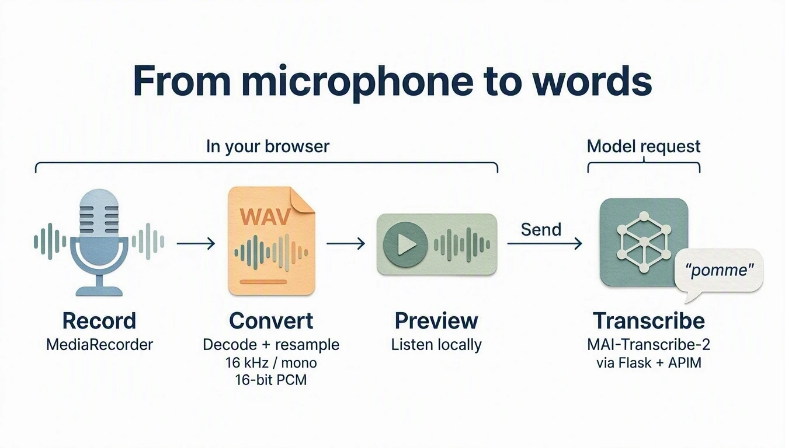
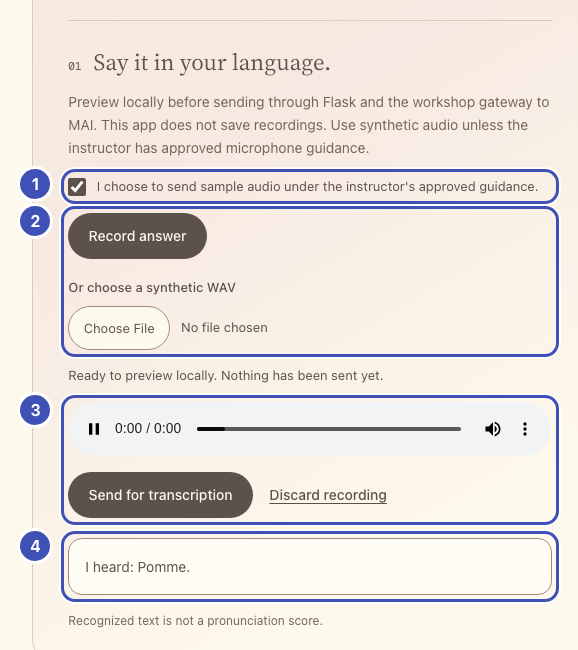
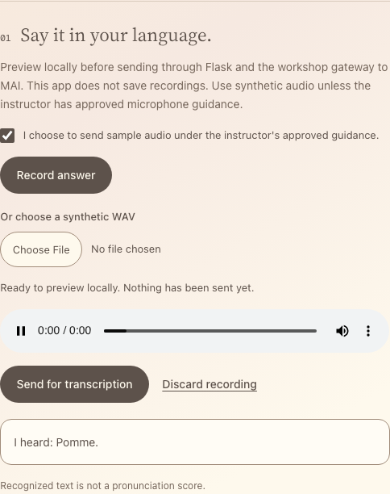

# Speak and see what was heard

Record an answer, or choose a synthetic WAV, and show what MAI-Transcribe-2
heard. The provided recorder produces the WAV; you write the transcription route.

{ width="960" height="549" loading="lazy" }

*MAI-generated diagram. [Full size](../assets/diagrams/audio-path.webp).*

## How it works

`setupAnswerRecorder()` in `workshop.js` handles consent, the microphone, the
12-second limit, the synthetic-WAV picker, and the local preview. `MediaRecorder`
does not produce WAV, so the helper decodes its output, resamples it to mono
16 kHz with `OfflineAudioContext`, and writes 16-bit PCM. Nothing leaves the
browser until you press **Send**.

Your route forwards the WAV as multipart form data: an `audio` file plus a
JSON-encoded `definition`. `enhancedMode` selects MAI-Transcribe-2; `locales`
takes a language code such as `fr`, not `fr-FR`.
[API details](https://learn.microsoft.com/azure/ai-services/speech-service/mai-transcribe).

## Build

**What you'll build.**

{ width="578" loading="lazy" }

- ❶ **Consent checkbox**: nothing is recorded or sent until it is ticked.
- ❷ **Record answer / Or choose a synthetic WAV**: the provided recorder turns either into a 16 kHz WAV.
- ❸ **Preview and Send**: you hear the WAV first; **Send** posts it to your `/transcribe` route.
- ❹ **Transcript card**: shows the text that `/transcribe` returns.

The same numbers mark the highlighted lines in the code below. Keep or delete
those `❶` comments; they only link code to the picture.

### 1. Add the answer controls

!!! question "Why a consent box and a local preview?"

    Audio leaves the browser only when you choose, and you hear exactly what will
    be sent.

In `starter/templates/index.html`, replace
`<!-- Lesson 3: add answer controls here. -->` with:

```html title="starter/templates/index.html" hl_lines="4 5 6 7 13 14 15 19 20"
<section class="practice-step" aria-labelledby="voice-title">
  <div class="step-title"><span class="step-number">01</span><h3 id="voice-title">Say it in your language.</h3></div>
  <p class="muted">Preview locally before sending through Flask and the workshop gateway to MAI. This app does not save recordings. Use synthetic audio unless the instructor has approved microphone guidance.</p>
  <!-- ❶ -->
  <label class="consent-label"><input id="audio-consent" type="checkbox"> I choose to send sample audio under the instructor's approved guidance.</label>
  <!-- ❷ -->
  <div class="record-actions">
    <button id="record-answer" class="button primary" type="button">Record answer</button>
    <button id="stop-recording" class="button secondary" type="button" hidden>Stop recording</button>
    <label class="file-label" for="audio-file">Or choose a synthetic WAV<input id="audio-file" type="file" accept=".wav,audio/wav"></label>
  </div>
  <p id="record-status" class="status" role="status" aria-live="polite"></p>
  <!-- ❸ -->
  <audio id="audio-preview" controls hidden aria-label="Local audio, not yet sent"></audio>
  <div id="recording-review" class="record-actions" hidden>
    <button id="send-answer" class="button primary" type="button">Send for transcription</button>
    <button id="discard-recording" class="text-button" type="button">Discard recording</button>
  </div>
  <!-- ❹ -->
  <div id="answer-result" class="answer-result" role="status" hidden></div>
  <p class="fine-print">Recognized text is not a pronunciation score.</p>
</section>
```

### 2. Your turn: write `/transcribe`

!!! question "Why multipart with a JSON definition?"

    The API takes the audio as a file and its options as JSON: `enhancedMode`
    picks MAI-Transcribe-2, and `locales` gives the language hint that short words
    need.

In `starter/app.py`, replace `# Lesson 3: add the /transcribe route here.`
with a route that follows this contract.

| | |
| --- | --- |
| Flask receives | `POST /transcribe`, multipart form with `audio` (a WAV file) and `locale` |
| Gateway request | `POST {base}/speech/transcribe?api-version=2025-10-15` |
| Headers | Only `api-key` from `gateway()`; httpx sets the multipart type |
| Body | `files={"audio": ("answer.wav", audio, "audio/wav")}` and `data={"definition": json.dumps(definition)}` |
| Definition | `{"enhancedMode": {"enabled": True, "model": "MAI-Transcribe-2"}, "locales": [language["stt"]]}` |
| Flask returns | `{"text": "..."}` from the joined `combinedPhrases[].text`, or `422` if nothing was recognized |

```python title="Your turn: starter/app.py"
@app.post("/transcribe")
def transcribe():
    language = language_for(request.form.get("locale"))
    upload = request.files.get("audio")
    if upload is None:
        abort(400, "Record or choose a WAV before sending.")
    audio = upload.read()
    check_wav(audio)
    base, headers = gateway()
    # TODO 1: Build the definition dict with enhancedMode and locales: [language["stt"]].
    # TODO 2: httpx.post the multipart request from the contract, with
    #         params={"api-version": "2025-10-15"} and timeout=TIMEOUT.
    # TODO 3: payload = upstream_json(response); join the combinedPhrases texts;
    #         abort(422, ...) if nothing was recognized; return jsonify(text=text).
    abort(501, "Lesson 3: finish the /transcribe route.")
```

??? tip "Hint: what the gateway returns"

    A real response for a one-word French sample:

    ```json
    {
      "durationMilliseconds": 740,
      "combinedPhrases": [{"text": "Pomme."}],
      "phrases": [{"offsetMilliseconds": 0, "durationMilliseconds": 740,
                   "text": "Pomme.", "locale": "sk", "confidence": 0}]
    }
    ```

    Longer audio can produce several `combinedPhrases`; join their texts with a
    space. `upstream_json()` raises gateway errors and checks that the body is a JSON
    object; checking the list shape is up to you.

??? success "Reference solution"

    ```python title="starter/app.py" hl_lines="1 2 30 31"
    # ❸
    @app.post("/transcribe")
    def transcribe():
        language = language_for(request.form.get("locale"))
        upload = request.files.get("audio")
        if upload is None:
            abort(400, "Record or choose a WAV before sending.")
        audio = upload.read()
        check_wav(audio)
        base, headers = gateway()
        definition = {
            "enhancedMode": {"enabled": True, "model": "MAI-Transcribe-2"},
            "locales": [language["stt"]],
        }
        response = httpx.post(
            f"{base}/speech/transcribe",
            params={"api-version": "2025-10-15"}, headers=headers,
            files={"audio": ("answer.wav", audio, "audio/wav")},
            data={"definition": json.dumps(definition)}, timeout=TIMEOUT,
        )
        payload = upstream_json(response)
        phrases = payload.get("combinedPhrases")
        if not isinstance(phrases, list) or not all(
            isinstance(item, dict) and isinstance(item.get("text"), str) for item in phrases
        ):
            abort(502, "The model returned no usable transcript.")
        text = " ".join(item["text"].strip() for item in phrases).strip()
        if not text:
            abort(422, "No words were recognized. Preview the sample or try again.")
        # ❹
        return jsonify(text=text)
    ```

### 3. Wire recording and sending

!!! question "Why convert to WAV in the browser?"

    `MediaRecorder` records compressed audio, often WebM. The provided recorder
    resamples it to the 16 kHz mono PCM your route checks, and nothing is uploaded
    before **Send**.

In `starter/static/app.js`, replace `// Lesson 3: add recording here.` with the
code below. It pauses speech when a new answer starts, sends the WAV and locale,
and ignores a late transcript if you discarded that recording meanwhile.

```javascript title="starter/static/app.js" hl_lines="1 2 13 14 20 21"
// ❶ ❷ ❸
const recorder = setupAnswerRecorder({
  onNewAudio: () => {
    stopAudio($("#speech-audio"));
    $("#answer-result").hidden = true;
  },
});

// Lesson 4: replace from this line to the matching end line.
function showTranscript(heard, word) {
  const result = $("#answer-result");
  result.className = "answer-result";
  // ❹
  result.textContent = `I heard: ${heard}`;
  result.lang = word.locale;
  result.hidden = false;
}
// Lesson 4: replace to this line.

// ❸
$("#send-answer").addEventListener("click", () => {
  const audio = recorder.audio();
  if (!audio) { showError("Record or choose a WAV first."); return; }
  if (!$("#audio-consent").checked) { showError("Choose whether to send sample audio first."); return; }
  const word = selectedWord();
  $("#answer-result").hidden = true;
  runAction("MAI is transcribing your sample...", async () => {
    const form = new FormData();
    form.append("audio", audio, "answer.wav");
    form.append("locale", word.locale);
    const result = await appJSON(await callApp("/transcribe", {method: "POST", body: form}));
    if (typeof result.text !== "string" || !result.text.trim()) {
      throw new Error("No usable transcript was returned.");
    }
    if (recorder.audio() === audio) showTranscript(result.text, word);
  });
});
onWordChange(() => {
  recorder.discard();
  $("#answer-result").hidden = true;
});
```

**Run:** save and reload the app tab. Select a pair, tick the audio checkbox,
record its translation, stop, and preview. Press **Send for transcription**.
Network shows multipart `audio` and `locale`; the card shows
**I heard: Pomme.** Note the capital and the full stop: lesson 4 handles them.

{ width="484" loading="lazy" }

*Captured with a recorded example transcript.*

**No microphone?** Choose the synthetic WAV you downloaded in lesson 2 and use
the same Send button. If a permission prompt hangs, **Stop recording** unlocks
the file picker. Keep samples under the 12-second limit. A one-word sample
should preview for under a second; about 2 seconds means speech added words,
so download it again.

**Catch up:** `python checkpoints/restore.py 03` copies this lesson's finished
files over yours, after backing yours up.

## Try one

- **Language hint on and off.** Remove the `locales` entry from `definition`,
  save, and send the same WAV. Clean samples of common words usually come back
  unchanged. Very short words show the difference: add `tree` / `fa` in
  Hungarian, download its WAV, and send it with and without the hint. In our
  tests it came back as another word without the hint (`Phó`, `Pa.`) and as
  `Fa.` with it. Restore the entry.
- **Look at the detected language.** Add
  `app.logger.warning("transcription: %s", payload)` after
  `payload = upstream_json(response)` and send a one-word sample. In the Flask
  terminal, find the line with `WARNING in app:`: `phrases[].locale` is often
  wrong for single words (we saw `sk` for French `Pomme.`). That is why the hint
  helps.
- **Word versus phrase.** Compare an isolated word with a short phrase in the
  same language. Does the added context change the transcript?

[Next: check the answer](04-check-your-answer.md).
