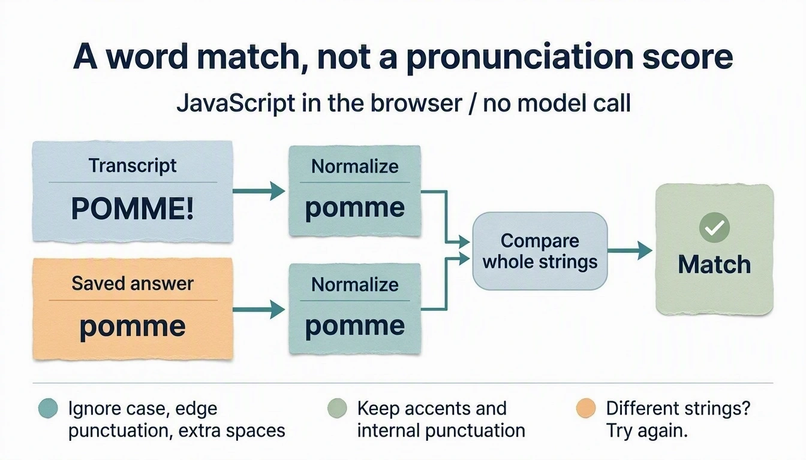
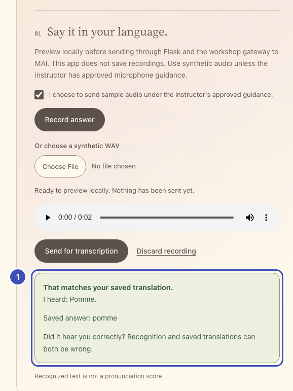
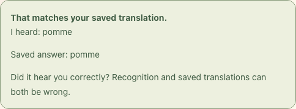

# Check your answer

Compare what MAI heard with your saved translation and show a match or a retry.
This runs in JavaScript; no model call. You write the comparison.

{ width="960" height="549" loading="lazy" }

*MAI-generated diagram. [Full size](../assets/diagrams/answer-matching.webp).*

## Your turn: normalize and compare

**What you'll build.**

{ width="578" loading="lazy" }

- ❶ **Answer card**: your `normalizeAnswer` comparison decides between a match and a retry.

The same numbers mark the highlighted lines in the code below. Keep or delete
those `❶` comments; they only link code to the picture.

!!! question "Why normalize instead of comparing strings?"

    The model writes `Pomme.` with a capital and a full stop; a saved `pomme`
    should still match. Accents and inner punctuation stay because they change the
    word. Matching needs no model, so it is instant, free, and deterministic.

Lesson 3 showed **I heard: Pomme.** for the saved answer `pomme`. A fair check
ignores case, punctuation around the answer, and extra spaces, but keeps
accents and punctuation inside it. It compares whole strings, not substrings.

In `starter/static/app.js`, replace everything from
`// Lesson 4: replace from this line` to `// Lesson 4: replace to this line.`,
including both marker lines, with your version of these two functions.

| Call | Should return |
| --- | --- |
| `normalizeAnswer(" POMME! ", "fr-FR")` | `"pomme"` |
| `normalizeAnswer("Été.", "fr-FR")` | `"été"` |
| `normalizeAnswer("une   pomme", "fr-FR")` | `"une pomme"` |
| `normalizeAnswer("l'été", "fr-FR")` | `"l'été"` |
| `normalizeAnswer("İ", "tr-TR")` | `"i"` |

```javascript title="Your turn: starter/static/app.js"
function normalizeAnswer(text, locale) {
  // TODO: NFC-normalize, lowercase for `locale`, remove punctuation and
  // whitespace at both ends, and collapse inner whitespace to one space.
  return text;
}

function showTranscript(heard, word) {
  const actual = normalizeAnswer(heard, word.locale);
  const expected = normalizeAnswer(word.target, word.locale);
  if (!actual) throw new Error("The transcript contains no usable words. Try another sample.");
  if (!expected) throw new Error("Your saved translation needs words, not only punctuation.");
  const matches = false; // TODO: compare the two normalized strings.
  const result = $("#answer-result");
  result.className = `answer-result ${matches ? "matched" : "try-again"}`;
  result.removeAttribute("lang");
  const heading = document.createElement("strong");
  heading.textContent = matches ? "That matches your saved translation." : "Not a match this time.";
  const transcript = document.createElement("p");
  transcript.textContent = `I heard: ${heard}`;
  transcript.lang = word.locale;
  const saved = document.createElement("p");
  saved.textContent = `Saved answer: ${word.target}`;
  saved.lang = word.locale;
  const caveat = document.createElement("p");
  caveat.textContent = "Did it hear you correctly? Recognition and saved translations can both be wrong.";
  result.replaceChildren(heading, transcript, saved, caveat);
  result.hidden = false;
}
```

??? tip "Hint: the building blocks"

    - `text.normalize("NFC")` makes `é` typed as one character equal `e` plus a
      combining accent.
    - `toLocaleLowerCase(locale)` lowercases by the word's language; Turkish `İ`
      becomes `i`. Normalize again afterwards.
    - `/^[\p{P}\s]+|[\p{P}\s]+$/gu` matches Unicode punctuation and spaces at
      either end; `/\s+/gu` finds runs of inner whitespace.

??? success "Reference solution"

    ```javascript title="starter/static/app.js" hl_lines="11 12 17 18"
    function normalizeAnswer(text, locale) {
      return text.normalize("NFC").toLocaleLowerCase(locale).normalize("NFC").trim()
        .replace(/^[\p{P}\s]+|[\p{P}\s]+$/gu, "").replace(/\s+/gu, " ");
    }

    function showTranscript(heard, word) {
      const actual = normalizeAnswer(heard, word.locale);
      const expected = normalizeAnswer(word.target, word.locale);
      if (!actual) throw new Error("The transcript contains no usable words. Try another sample.");
      if (!expected) throw new Error("Your saved translation needs words, not only punctuation.");
      // ❶
      const matches = actual === expected;
      const result = $("#answer-result");
      result.className = `answer-result ${matches ? "matched" : "try-again"}`;
      result.removeAttribute("lang");
      const heading = document.createElement("strong");
      // ❶
      heading.textContent = matches ? "That matches your saved translation." : "Not a match this time.";
      const transcript = document.createElement("p");
      transcript.textContent = `I heard: ${heard}`;
      transcript.lang = word.locale;
      const saved = document.createElement("p");
      saved.textContent = `Saved answer: ${word.target}`;
      saved.lang = word.locale;
      const caveat = document.createElement("p");
      caveat.textContent = "Did it hear you correctly? Recognition and saved translations can both be wrong.";
      result.replaceChildren(heading, transcript, saved, caveat);
      result.hidden = false;
    }
    ```

**Check:** save, reload, and try the calls from the table in the browser's
DevTools console; functions in `app.js` are global.

**Run:** send the lesson 3 sample again. The card says
**That matches your saved translation.** Then send a different word's WAV
against the same entry and confirm **Not a match this time.** This checks the
recognized word, not pronunciation quality.

{ width="484" loading="lazy" }

*Captured with a recorded example transcript.*

**Catch up:** `python checkpoints/restore.py 04` copies this lesson's finished
files over yours, after backing yours up.

## Try one

- **Compare strictly.** Replace `const matches = actual === expected;` with
  `const matches = heard === word.target;`, reload, and resend: `Pomme.` no
  longer matches `pomme`. Restore normalization.
- **Accents count.** Save `summer` / `été` and `summer` / `ete` in French,
  download the `été` WAV, and send it to both: only the accented entry matches.
  First check that the preview plays for under a second. About one in five
  one-word downloads contains extra speech (we got a 1.9-second take that said
  `un été. Été.`, which matches neither entry); download it again if so.

[Next: generate a memory image](05-memory-images.md).
