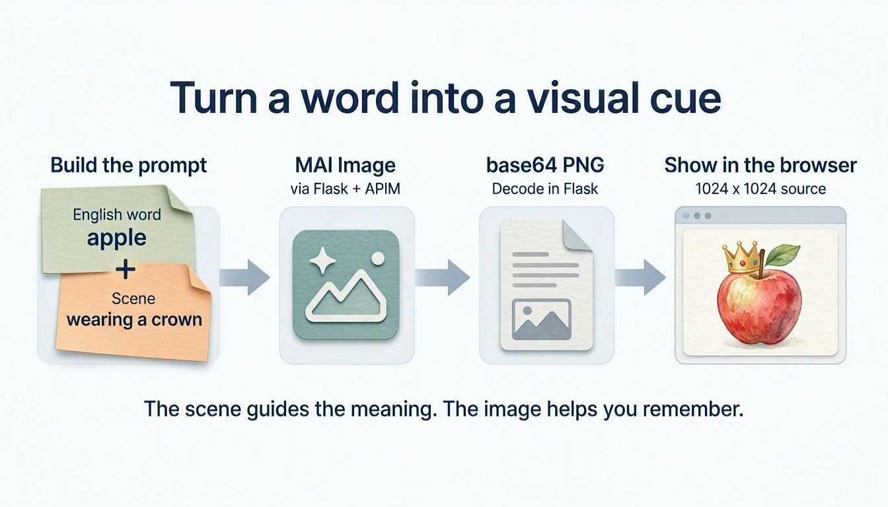
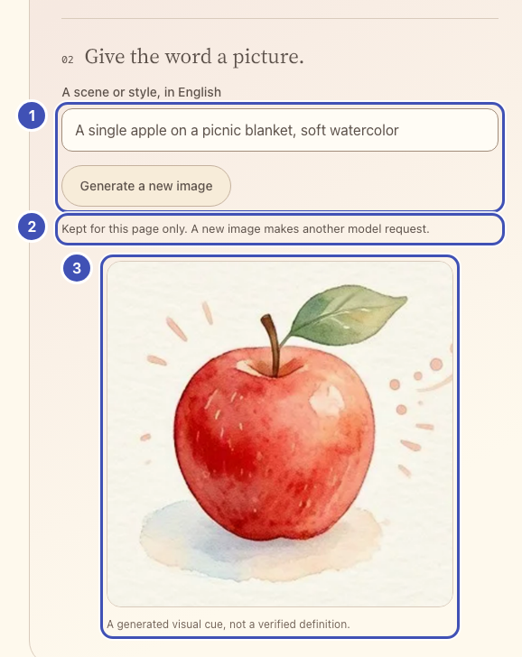
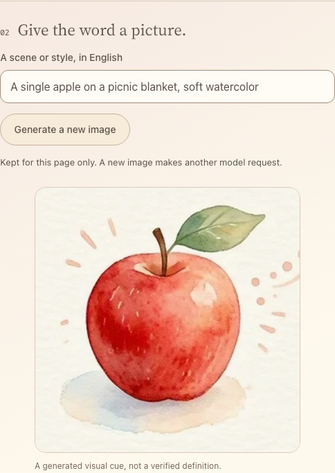

# Make a visual memory cue

Generate a picture that helps you remember a word. You write the route that
asks MAI-Image-2.6-Flash for it.

{ width="960" height="549" loading="lazy" }

*MAI-generated diagram. [Full size](../assets/diagrams/image-flow.webp).*

## How it works

Your `/image` route sends an English prompt and 1024 × 1024 dimensions to the
gateway's image endpoint with deployment `mai-image-flash`. The JSON answer
carries the picture as a base64 PNG in `data[0].b64_json`; Flask decodes and
checks it and returns `image/png`. A picture takes about 10–15 seconds.
[API details](https://learn.microsoft.com/azure/foundry/foundry-models/how-to/use-foundry-models-mai-image).

## Build

**What you'll build.**

{ width="578" loading="lazy" }

- ❶ **Scene and button**: the button posts the word and your scene to `/image`.
- ❷ **Status line**: says the picture is kept for this page.
- ❸ **Picture**: the PNG that your `/image` route decoded.

The same numbers mark the highlighted lines in the code below. Keep or delete
those `❶` comments; they only link code to the picture.

### 1. Add the image controls

!!! question "Why an English scene?"

    The prompt is built in English, and the scene picks the meaning you want, such
    as a river bank rather than a savings bank.

In `starter/templates/index.html`, replace
`<!-- Lesson 5: add memory controls here. -->` with:

```html title="starter/templates/index.html" hl_lines="4 5 6 7 8 9 10"
<section class="practice-step" aria-labelledby="image-title">
  <div class="step-title"><span class="step-number">02</span><h3 id="image-title">Give the word a picture.</h3></div>
  <label for="image-detail">A scene or style, in English</label>
  <!-- ❶ -->
  <input id="image-detail" maxlength="360" placeholder="A tiny apple wearing a crown">
  <button id="generate-image" class="button secondary" type="button">Make a memory image</button>
  <!-- ❷ -->
  <p id="image-status" class="status" role="status" aria-live="polite"></p>
  <!-- ❸ -->
  <figure id="memory-figure" class="memory-figure" hidden>
    <div id="image-mount"></div>
    <figcaption>A generated visual cue, not a verified definition.</figcaption>
  </figure>
</section>
```

### 2. Your turn: write `/image`

!!! question "Why decode the image in Flask?"

    The gateway returns JSON with a base64 PNG. Decoding and checking it on the
    server means the browser only ever receives a real 1024 × 1024 image.

In `starter/app.py`, replace `# Lesson 5: add the /image route here.` with a
route that follows this contract.

| | |
| --- | --- |
| Flask receives | `POST /image` with JSON `{"word": "apple", "detail": "an optional scene"}` |
| Gateway request | `POST {base}/mai/v1/images/generations` |
| Headers | `api-key` from `gateway()`; `json=` sets the JSON content type |
| Body | `{"model": os.getenv("MAI_IMAGE_DEPLOYMENT", "mai-image-flash"), "prompt": ..., "width": 1024, "height": 1024}` |
| Prompt | `Illustrate the English vocabulary word "{word}" as a memorable, clear visual cue. No letters or captions. {detail}` |
| Flask returns | The decoded PNG as `image/png`, after `check_png(png)` |

```python title="Your turn: starter/app.py"
@app.post("/image")
def image():
    data = json_body()
    word = text_field(data, "word")
    detail = optional_text(data, "detail", limit=360)
    base, headers = gateway()
    # TODO 1: httpx.post the contract's JSON body to f"{base}/mai/v1/images/generations"
    #         with json=..., headers=headers, and timeout=TIMEOUT.
    # TODO 2: payload = upstream_json(response); read payload["data"][0]["b64_json"].
    # TODO 3: base64.b64decode(encoded, validate=True), check_png(png), and
    #         return Response(png, mimetype="image/png").
    abort(501, "Lesson 5: finish the /image route.")
```

??? tip "Hint: what the gateway returns"

    The response looks like this (the base64 string is about 2.4 MB):

    ```json
    {
      "created": 1790283468,
      "data": [{"b64_json": "iVBORw0KGgoA..."}],
      "model": "mai-image-flash",
      "size": "1024x1024",
      "usage": {"num_output_tokens": 1024, "num_input_text_tokens": 22, "num_input_image_tokens": 0}
    }
    ```

    `base64.b64decode(..., validate=True)` raises `binascii.Error` for invalid
    input; turn that into `abort(502, ...)`. `check_png()` stops unless the bytes
    are a 1024 × 1024 PNG.

??? success "Reference solution"

    ```python title="starter/app.py" hl_lines="1 2 31 32"
    # ❶
    @app.post("/image")
    def image():
        data = json_body()
        word = text_field(data, "word")
        detail = optional_text(data, "detail", limit=360)
        base, headers = gateway()
        response = httpx.post(
            f"{base}/mai/v1/images/generations", headers=headers,
            json={
                "model": os.getenv("MAI_IMAGE_DEPLOYMENT", "mai-image-flash"),
                "prompt": (
                    f'Illustrate the English vocabulary word "{word}" as a memorable, '
                    f"clear visual cue. No letters or captions. {detail}"
                ),
                "width": 1024, "height": 1024,
            }, timeout=TIMEOUT,
        )
        payload = upstream_json(response)
        entries = payload.get("data")
        if not isinstance(entries, list) or not entries or not isinstance(entries[0], dict):
            abort(502, "The image model returned no image.")
        encoded = entries[0].get("b64_json")
        if not isinstance(encoded, str) or len(encoded) > 24 * 1024 * 1024:
            abort(502, "The image model returned an invalid image payload.")
        try:
            png = base64.b64decode(encoded, validate=True)
        except (binascii.Error, ValueError):
            abort(502, "The image model returned invalid base64.")
        check_png(png)
        # ❸
        return Response(png, mimetype="image/png")
    ```

### 3. Show and keep the pictures

!!! question "Why keep pictures per word?"

    Each picture costs a model request of 10–15 seconds. Keeping it for the page
    makes switching words instant.

In `starter/static/app.js`, replace `// Lesson 5: add memory images here.` with
the code below. It keeps one picture per word for this page, so switching back
shows it again without another request.

```javascript title="starter/static/app.js" hl_lines="5 6 10 11 14 15"
const imageCache = new Map();

function renderMemory() {
  const cached = imageCache.get(selectedId);
  // ❸
  $("#image-mount").replaceChildren(...(cached ? [cached.picture] : []));
  $("#memory-figure").hidden = !cached;
  $("#image-detail").value = cached?.detail ?? "";
  $("#generate-image").textContent = cached ? "Generate a new image" : "Make a memory image";
  // ❷
  $("#image-status").textContent = cached ? "Kept for this page only. A new image makes another model request." : "";
}

// ❶
$("#generate-image").addEventListener("click", () => {
  const word = selectedWord();
  const detail = $("#image-detail").value.trim();
  runAction("MAI Image is making a visual cue...", async () => {
    const response = await callApp("/image", jsonOptions({word: word.english, detail}));
    if (!response.headers.get("Content-Type")?.includes("image/png")) {
      throw new Error("Expected a PNG. Reopen the app if Codespaces sign-in expired.");
    }
    const url = URL.createObjectURL(await response.blob());
    const picture = new Image();
    picture.id = "memory-image";
    picture.alt = `Generated visual cue for ${word.english}`;
    picture.src = url;
    try { await picture.decode(); }
    catch {
      URL.revokeObjectURL(url);
      throw new Error("The returned image could not be displayed.");
    }
    const previous = imageCache.get(word.id);
    if (previous) URL.revokeObjectURL(previous.url);
    imageCache.set(word.id, {picture, url, detail});
    renderMemory();
  });
});
onWordChange(renderMemory);
window.addEventListener("pagehide", () => {
  for (const cached of imageCache.values()) URL.revokeObjectURL(cached.url);
});
```

**Run:** save, reload, and press **Make a memory image**. Network shows
`POST /image` answered by `image/png`. Switch words and back: the picture
returns. Reloading clears pictures, not the word list.

If you click quickly or many people share one key, the gateway answers `429`;
the app then says how many seconds to wait.

{ width="484" loading="lazy" }

*Captured with an example image response.*

**Catch up:** `python checkpoints/restore.py 05` copies this lesson's finished
files over yours, after backing yours up.

### One word, two explicit scenes

The scene prompt distinguishes two meanings of `bank`:

| **River bank**: the natural edge of a river | **Savings bank**: a financial institution |
| --- | --- |
| { width="280" height="280" loading="lazy" } | { width="280" height="280" loading="lazy" } |

*MAI-generated examples with different prompts. [Exact prompts](../assets/images/provenance.json).*

## Try one

Each Generate click is a new model request.

- For `apple`, compare an empty scene with
  `A single apple on a picnic blanket, soft watercolor`.
- For `bank`, compare `A river bank with reeds, no buildings` with
  `A bank building on a city street`. Which matches your saved translation?
- **Flash versus the full model.** In `.env`, change `MAI_IMAGE_DEPLOYMENT` to
  `mai-image` (add the line if it is missing), restart Flask (the reloader does
  not watch `.env`), and generate the same prompt. In our tests MAI-Image-2.6
  took about 30 seconds, Flash about 13. Change it back to `mai-image-flash`
  afterwards.
- **See what you used.** Add `app.logger.warning("usage: %s", payload.get("usage"))`
  after `payload = upstream_json(response)`. In the Flask terminal, find the
  line with `WARNING in app: usage:` and its token counts, such as
  `num_output_tokens: 1024`. Compare them with the
  [cost page](../compare-models.md).

**Finish:** use the full loop: select, listen, record or upload, check, and
picture. Then try [optional mnemonics](../extensions/mnemonics.md) or
[compare models and cost](../compare-models.md).
